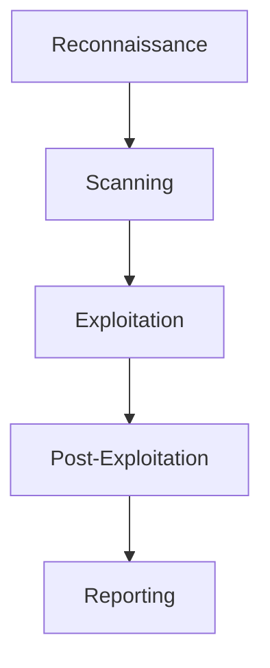

## Introduction

Penetration Testing (Pentesting) is the practice of simulating cyberattacks against systems to uncover vulnerabilities before malicious actors do. It involves various tools and techniques, and spans both web applications and network infrastructure.

## Types of Pentesting

### Web Application Pentesting

- Testing web apps for flaws like:
  - SQL Injection
  - Cross-Site Scripting (XSS)
  - Broken Authentication
  - Insecure Deserialization
  - CSRF and more

### Network Pentesting

- Focused on networks, routers, switches, etc.
- Activities include:
  - Port scanning
  - Banner grabbing
  - Vulnerability scanning
  - Exploiting unpatched services

## Checklist

- [x] Reconnaissance
- [x] Scanning
- [ ] Exploitation
- [ ] Post-Exploitation
- [ ] Reporting

## Important Concepts

Firewall  
: A network boundary device that filters traffic based on rules.

Payload  
: The malicious component sent to exploit a vulnerability.

Shell  
: A command interface attackers use after gaining access.

## Tools

| Tool       | Purpose                | Category |
| ---------- | ---------------------- | -------- |
| Nmap       | Network discovery      | Network  |
| Burp Suite | Web proxy and scanner  | Web      |
| Metasploit | Exploitation framework | Exploits |
| Nikto      | Web server scanner     | Web      |
| Wireshark  | Packet analysis        | Network  |

## Recon Script Example

```bash
nmap -sC -sV -oN recon.txt 192.168.1.10
```

## Diagrams


